<div align="center">
  
</div>

### `~/whoami`

<div align="center">
  
</div>

### `~/stack`

<div align="center">
  
</div>

### `~/career`

<div align="center">
  
</div>

### `~/highlights`

```text
numerAIModel     Top 20 in North America over 3 months, 60% returns, era based validation
                 github.com/kayne-lee/numerAIModel

qtma             Director of Developers. 4 product teams, 10+ engineers mentored,
                 winner of the QTMA McKinsey Pitch Competition with Nucleus
```

### `~/stats`

<div align="center">
  
</div>

<div align="center">
  
</div>

### `~/connect`

```bash
$ open linkedin.com/in/kaynelee        # professional
$ open kayneleev2.vercel.app           # portfolio
$ mail kayne.lee2@outlook.com          # inbox
```

<div align="center">
  <sub>off the clock: AA hockey · running · piano · Gundam builds · sneakers · markets</sub>
</div>